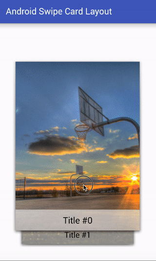

# **Android Swipe Card Layout**




##**Getting Started**
### Requirements
- API >= 15

### Installation
Download grab the AAR from Maven Central by adding it as a dependency in your **build.gradle** file:

```groovy
repositories {
    maven {
        url 'https://dl.bintray.com/kurtulusahmet/maven'
    }
}
dependencies {
    compile 'com.kurtulusdev.androidswipecardlayout.library:library:1.0.0@aar'
}
```
Alternatively, clone the repo and add `library` as a module to your project.

### Usage

1 - Create a RelativeLayout in Activity
	
```java
// in Activity Context and
scContainer = (RelativeLayout) findViewById(R.id.swipeable_cards_container);

        SwipeCardLayout swipeCardLayout = new SwipeCardLayout(getApplicationContext(),scContainer);
	
```

2 - Create CardObject List:

```java
ArrayList<CardObject> cardList = new ArrayList<CardObject>();
        cardList.add(swipeCardLayout.createCardObject("Title #0", R.mipmap.basket5));
        cardList.add(swipeCardLayout.createCardObject("Title #1", "http://lorempixel.com/400/300/sports/1/"));
        cardList.add(swipeCardLayout.createCardObject("Title #2", R.mipmap.basket1));
        cardList.add(swipeCardLayout.createCardObject("Title #3", "http://lorempixel.com/400/300/sports/2/"));
        cardList.add(swipeCardLayout.createCardObject("Title #4", R.mipmap.basket2));
 
```

3 - Render Cards:

```java
swipeCardLayout.addCards(cardList);
        swipeCardLayout.renderCards();
```

## Licence
See file [LICENCE](https://github.com/kurtulusahmet/android-swipe-card-layout/blob/master/LICENCE).